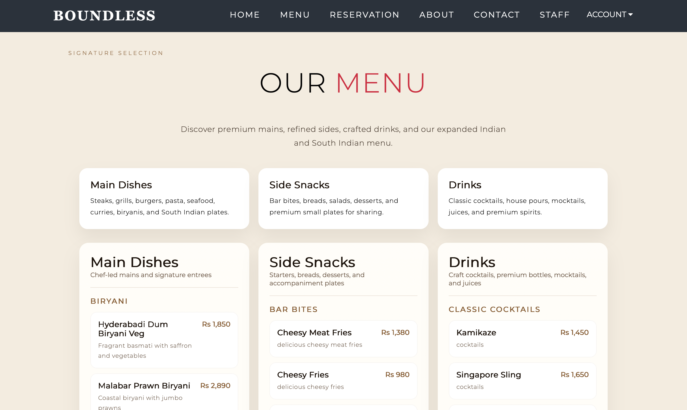
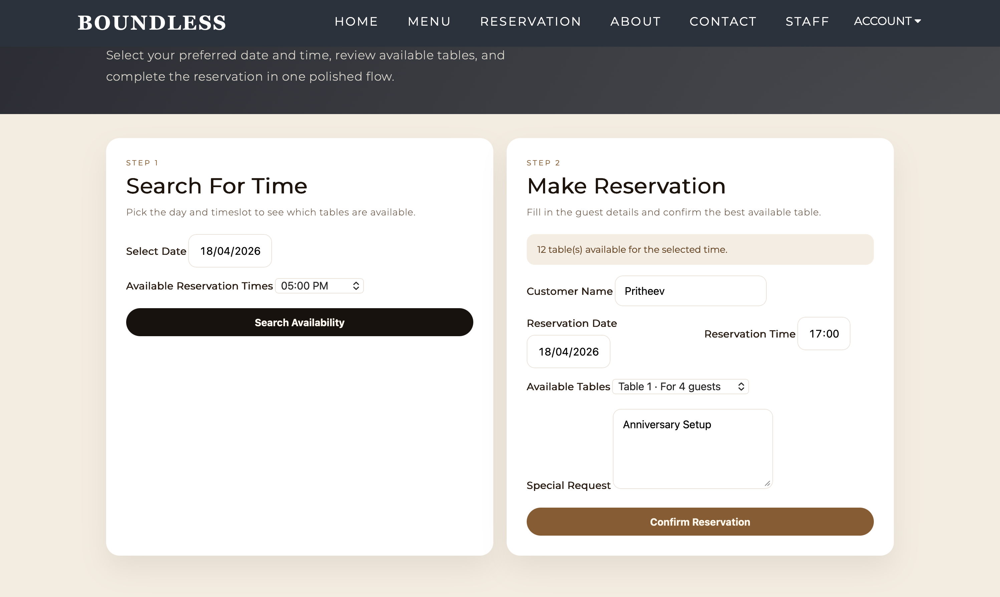
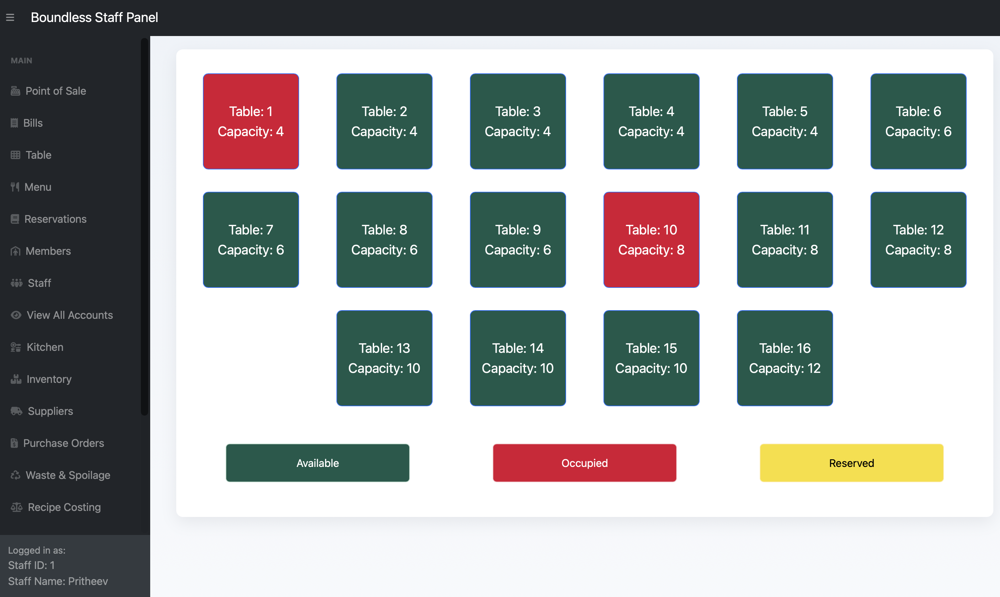
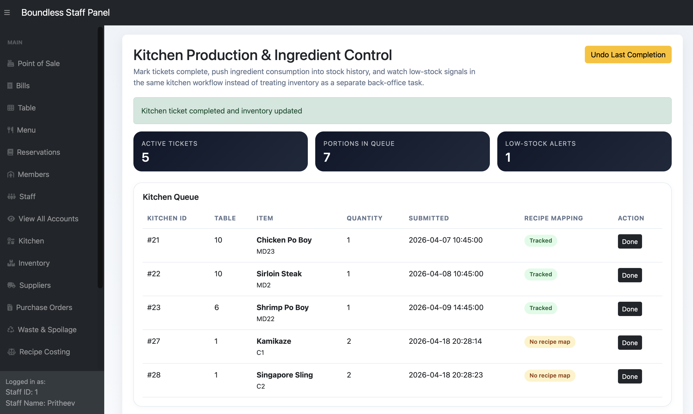
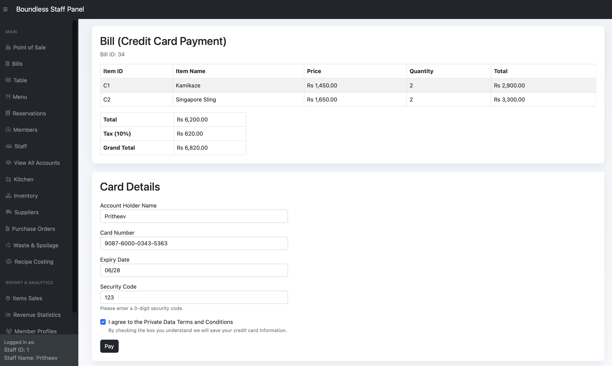
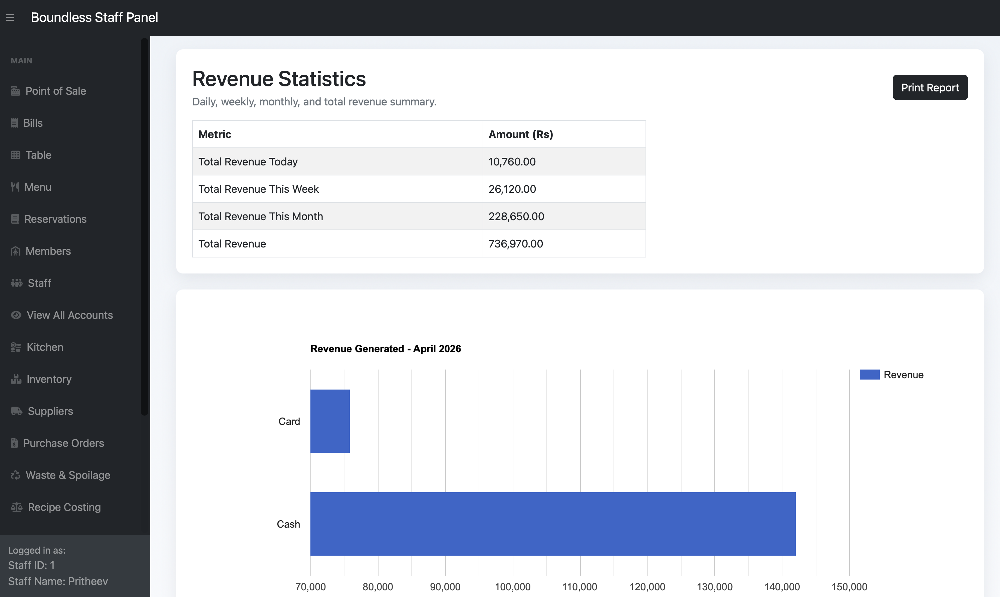
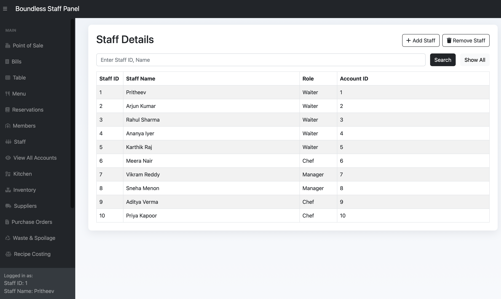
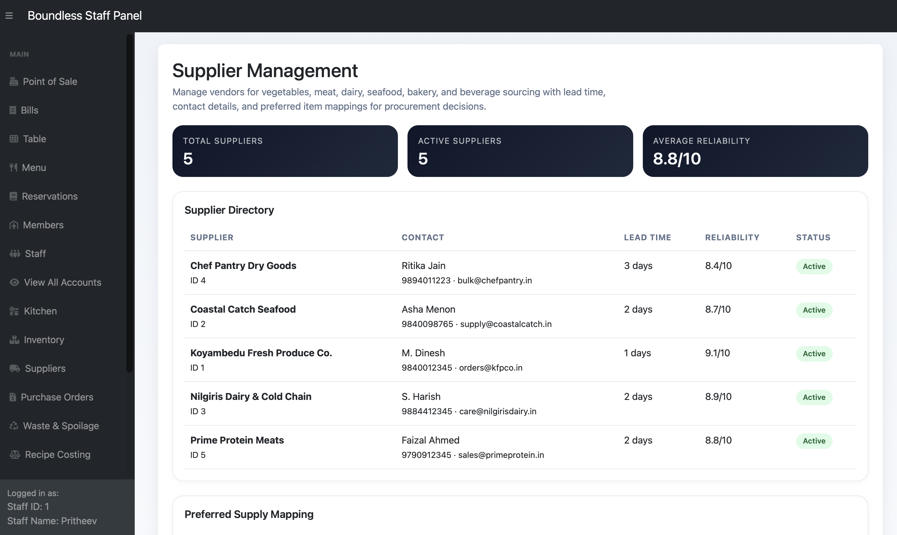
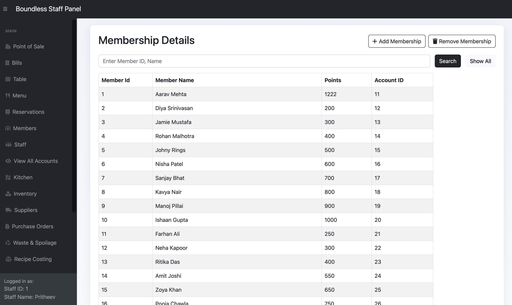

<div align="center">

# 🍽️ Restaurant Management System

**A complete full-stack restaurant management and POS system**

[](https://www.php.net/)
[](https://www.mysql.com/)
[](https://getbootstrap.com/)
[](https://developer.mozilla.org/)
[](LICENSE)

<br>

A full-stack restaurant management system built with **PHP**, **MySQL**, **HTML/CSS**, **JavaScript**, and **Bootstrap**. It includes a customer-facing website for browsing menus and making reservations, alongside a powerful staff dashboard for POS billing, kitchen coordination, and comprehensive revenue analytics.

</div>

---

## 📑 Table of Contents

- [Screenshots](#-screenshots)
- [Modules](#-modules)
- [Key Features](#-key-features)
- [Tech Stack](#-tech-stack)
- [Database Design](#-database-design)
- [Project Structure](#-project-structure)
- [Getting Started](#-getting-started)
- [Configuration](#-configuration)
- [Demo Credentials](#-demo-credentials)
- [Demo Data](#-demo-data)
- [Academic Value](#-academic-value)
- [License](#-license)

---

## 📸 Screenshots

<p align="center">
   &nbsp;
   <br><br>
   &nbsp;
   <br><br>
   &nbsp;
   <br><br>
   &nbsp;
   <br><br>
   &nbsp;
   <br><br>
   &nbsp;
  
</p>

---

## 📦 Modules

### 👤 Customer Side

| Feature | Description |
|---------|-------------|
| 🍕 Menu Browsing | Explore the full restaurant menu with categories and pricing |
| 🔐 Authentication | Customer registration and login system |
| 👤 Profile | View profile details and membership information |
| 📅 Reservations | Book table reservations with date and time selection |
| 🧾 Receipts | Download or view reservation receipts |

### 🛠️ Staff & Admin Side

| Feature | Description |
|---------|-------------|
| 🔑 Staff Login | Secure staff authentication system |
| 💰 POS Billing | Full point-of-sale billing system |
| 🛒 Cart Management | Add, update, and remove bill items |
| 👨‍🍳 Kitchen Orders | Kitchen order coordination and tracking |
| 💳 Payments | Cash and card payment processing |
| 📊 Revenue Reports | Revenue statistics with printable reports |
| ⚙️ CRUD Operations | Manage menu, tables, reservations, customers, staff, and accounts |

---

## ✨ Key Features

<details>
<summary><b>📅 Reservations</b></summary>

- Customer and admin reservation flows
- Real-time table availability handling
- Duplicate-slot protection with explicit concurrency control
- Downloadable reservation receipt generation

</details>

<details>
<summary><b>💰 POS & Billing</b></summary>

- Create and manage bills from the staff dashboard
- Add items to bills with quantity management
- Update cart quantities with safe concurrency handling
- Process cash and card payments
- Generate printable receipts

</details>

<details>
<summary><b>📊 Reporting & Analytics</b></summary>

- Revenue summary — today, this week, this month, and total
- Payment method distribution charts
- Most purchased items analytics
- Printable report generation

</details>

---

## 🛠️ Tech Stack

<div align="center">

| Layer | Technologies |
|-------|-------------|
| **Backend** |  |
| **Database** |  |
| **Frontend** |    |
| **UI Framework** |  |
| **Charts** |  |
| **PDF** |  |

</div>

---

## 🗄️ Database Design

The project uses a **normalized relational MySQL schema** with the following tables:

```
Accounts  ─┬──  Staffs
            └──  Memberships

Reservations  ──  Restaurant_Tables  ──  Table_Availability

Bills  ──  Bill_Items  ──  Menu
  └──  card_payments

Kitchen
```

**Design Highlights:**

- ✅ Normalized table separation for accounts, staff, memberships, reservations, billing, and menu
- ✅ Foreign keys to maintain referential integrity
- ✅ Unique constraints for reservation slots and bill item combinations
- ✅ Check constraints for data validation
- ✅ Transactions in multi-step account, reservation, billing, and payment flows
- ✅ Concurrency control using transactions, locks, and guarded updates

---

## 📂 Project Structure

```
restaurant-management-system/
├── index.php                 # Entry page — setup & module access
├── restaurantDB.txt          # Database schema & seed data
├── images/                   # Screenshot images for README
├── customerSide/             # Customer website
│   ├── config.php            # Database configuration
│   ├── login / register      # Authentication pages
│   ├── menu                  # Menu browsing
│   └── reservations          # Reservation flow & receipts
└── adminSide/                # Staff dashboard
    ├── config.php            # Database configuration
    ├── POS module            # Point-of-sale billing
    ├── CRUD operations       # Manage all entities
    └── reports               # Revenue analytics & reports
```

---

## 🚀 Getting Started

### Prerequisites

- **PHP** 8.x or higher
- **MySQL** 8.0 or higher

### Installation

1. **Clone the repository**

   ```bash
   git clone https://github.com/PritheevLingeswaran/restaurant-management-system.git
   cd restaurant-management-system
   ```

2. **Start the MySQL server**

   ```bash
   # macOS (Homebrew)
   brew services start mysql

   # Linux
   sudo systemctl start mysql
   ```

3. **Start the PHP development server**

   ```bash
   php -S 127.0.0.1:8001
   ```

4. **Open in your browser**

   ```
   http://127.0.0.1:8001
   ```

5. On **first run**, the project will initialize the database automatically using `restaurantDB.txt`.

---

## ⚙️ Configuration

Database connection settings are defined in:

| File | Purpose |
|------|---------|
| `adminSide/config.php` | Staff dashboard DB connection |
| `customerSide/config.php` | Customer website DB connection |

> **Note:** The database name is `restaurantDB` (case may vary depending on your MySQL OS settings).

---

## 🔑 Demo Credentials

| Role | ID | Password |
|------|----|----------|
| **Staff** | `1` | `password123` |
| **Admin** | `99999` | `12345` |

---

## 🎭 Demo Data

The seeded demo data has been curated for presentation purposes:

- 📅 Sample dates set to **March & April 2026**
- 👤 Staff, customer, and membership names use **Indian-style names**
- 📧 Account emails and phone numbers have been **normalized**
- 💎 Menu pricing updated to **premium 5-star hotel pricing**
- 🍛 Menu includes **Indian starters, tandoori dishes, curries, biryanis, naan & rice, South Indian dishes, and premium desserts**

---

## 🎓 Academic Value

This project is ideal for academic demonstration as it covers:

| Concept | Implementation |
|---------|---------------|
| Frontend–Backend Integration | PHP with HTML/CSS/JS |
| Relational Database Design | Normalized MySQL schema |
| CRUD Operations | Full entity management |
| Transaction Handling | Multi-step atomic operations |
| Concurrency Control | Locks, transactions, guarded updates |
| Reporting & Analytics | Charts, revenue summaries, PDF reports |
| Real-world Workflow | End-to-end restaurant operations |

---

## 📝 Notes

- MySQL must be running for database-backed pages to work correctly.
- The project contains seeded sample data intended for demo and review use.
- This application serves as a strong **academic and portfolio project** and can be extended with deployment, role-based access control, API integration, or cloud migration.

---

## 📄 License

This project is licensed under the **Apache License 2.0** — see the [LICENSE](LICENSE) file for details.

---

<div align="center">

**⭐ If you found this project useful, consider giving it a star!**

Made with ❤️ by [Pritheev Lingeswaran](https://github.com/PritheevLingeswaran)

</div>
